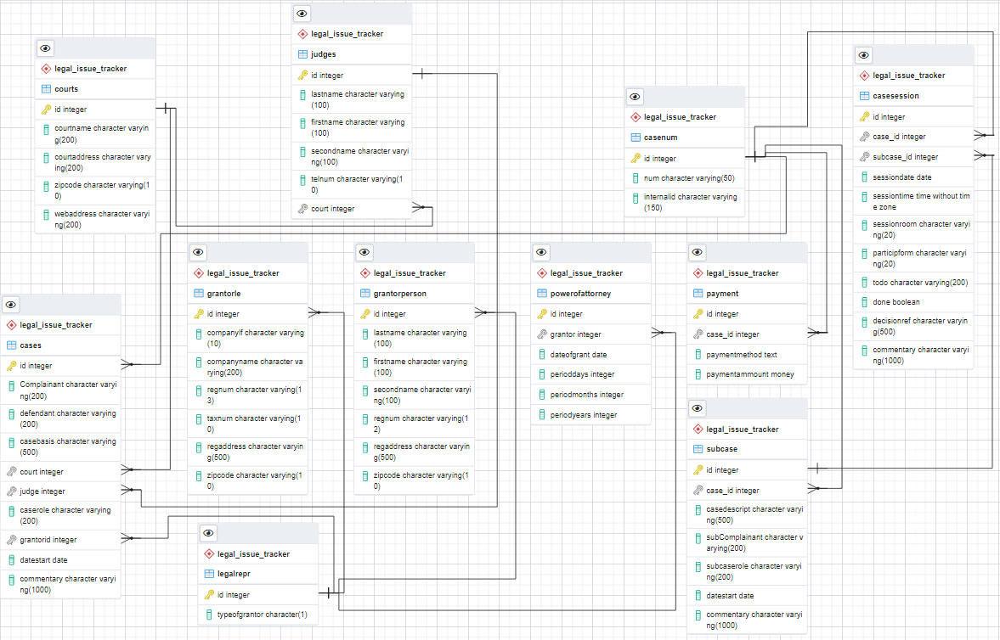

# Курсовой проект по курсу "Базы данных"

## Пояснения по содержанию файлов

|N|Файл|Описание|
|-|-|-|
|1|01_create_db_struct|DDL-скрипты, задающие структуру БД|
|2|02_random_gens|функции для генерации случайных значений соответствующего формата для наполнения БД|
|3|03_procedures_populate|процедуры для наполнения БД случайными значениями|
|4|04_execution_script|"головная" процедура для наполнения всей базы|
|5|05_queries|DML-запросы|

## Схема базы данных условного приложения "Трекер юридических задач"

