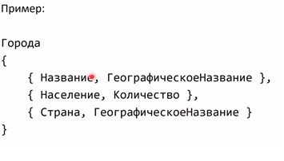
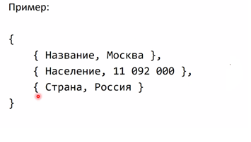
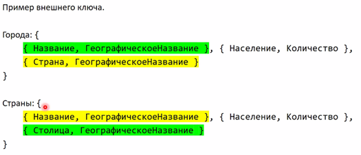

# 1. [Реляционная модель](#реляционная-модель). [Реляционные объекты данных: домены и отношения](#реляционные-объекты-данных-домены-и-отношения)

## Реляционная модель

РМД по Дейту состоит из трех аспектов:

1. Структурного

   Это аспект, описывающий структурные составляющие этой модели данных.

2. Целостного

   То, что не дает этой модели развалиться. То, что обеспечивает целостность модели - условияцелостности (набор правил, ограничений).

3. Манипуляционного

  То, что мы можем с этим делать: изменять модель, изменять данные (удалять, добавлять)

### Структурный аспект РМД

Основной структурой данных, используемой в реляционной модели, являются нормализованные «n-арные» отношения

Основные понятия:

- **Тип данных** (***множество значений. которе теоретически может появиться в ячейке таблицы***)
  
  4 аспекта:

  - Объем занимаемой памяти
  - Способ представления в памяти
  - Диапазон значений

    В объеме занимаемой памяти можно задать определенный диапазон значений. Количество занимаемых бит дает набор комбинаций

  - Набор операций

    То, что мы можем с этим делать: изменять модель, изменять данные (удалять, добавлять)

- #### **Домен** (***множество значений. которе реально может появиться в ячейке конкретной таблицы***)

  Подмножество значений некоторого типа данных, которое имеет определенный смысл. То есть домен определяется на каком-то типе как сужение (например, из множества целых чисел - подможество чисел, характеризующих рост или возраст человека) или совпадение с множеством значений этого типа

  Свойства:

  - Уникальное имя в пределах модели (базы данных)
  - Определен на некотором типе или домене
  - Может иметь некоторое логическое условие, описывающее подмножество допустимых данных
  - Несет определенную смысловую нагрузку

  По названию (описанию) домена должно быть однозначно понятно, что за данные в нем хранятся
  
  Домен отражает семантику предметной области и помогает ее правильно моделировать.

  Может быть несколько доменов, совпадающих как подмножества одного типа. При этом эти домены будут разными, поскольку по смыслу они обозначают разные аспекты. Также формально в определение домена входит его название, а значит, что если значения таких доменов будут одинаковыми, то они все равно будут различны. Сравнение значений из разных доменов некорректно. Примеры: фамилия и имя, название города и страны, возраст и рост, скорость и ускорение.

  Примеры доменов:
  
  - E-mail
  - Возраст
  - Фамилия и т.п.

- **Атрибут отношения** (***Имя столбца таблицы***)

  Это пара вида: `{ ИМЯ_АТРИБУТА, ИМЯ_ДОМЕНА }`

  Часто имена атрибутов отношения совпадают с именами отношения.

  Примеры:

  - <ФИО клиента, ФИО>
  - <Дата рождения, Дата>

- **Схема отношения** (***Именованная строка заголовка таблицы***)

  Это именованное множество атрибутов отношения. Степенью или «арностью» схемы отношения является мощность этого множества. Понятие схемы отношения близко к понятию структурного типа в языках программирования (например, record в языке Pascal или struct в языке C). Так, например, в C, имя структуры будет именем схемы, а имена полей – это имена атрибутов. Домены – это возможные значения полей. Условно это можно сопоставить таблице в БД.

  

- **Схема базы данных**

  Это множество именованных схем отношений

- **Кортеж** (***Строка значений в таблице (т.е. любая строка, не являющаяся заголовкам***)

  Кортеж, соответствующий данной схеме отношения, - это множество упорядоченных пар:
  
  `{ ИМЯ_АТРИБУТА, ЗНАЧЕНИЕ_АТРИБУТА }`
  
  Которое содержитт одно вхождение каждого имени атрибута, принадлежащего схеме отношения. Значение атрибута должно быть допустимым значением домена, на котором определен данный атрибут. Степень или «арность» кортежа совпадает с «арностью» соответствующей схемы отношения. Кортеж условно можно сопоставить строке таблицы.

  

- #### **Отношение** (***Это таблица со строками значений***)

  Отношение, определенное на множестве из n доменов (не обязательно различных), содержит две части:

   1. Заголовок (схему отношения с мощностью n)
   2. Тело (множество из m кортежей). По сути – это (конкретные) данные, словно это множество строк таблицы
  
  Условно, это заголовок таблицы + строки таблицы. Значения n («количество столбцов») и m («количество строк») называеются соответственно степенью и кардинальностью отношения.

  Свойства:

  - В отношении нет одинаковых кортежей. То есть в таблице не может (не должно быть) одинаковых строк. Причина – во множестве не может быть двух неотличимых элементов. Этот пункт, конечно, не соответствует реальности. В реальных РБД нет подобных ограничений.
  - В отношении нет атрибутов с одинаковыми именами. В таблице не может быть двух одинаковых столбцов. Это работает на практике.
  - Кортежи не упорядочены (сверху вниз). В БД это выполняется. В запросе можно задать порядок путем сортировки, но это операция, которая выполняется в процессе получения данных.
  - Атрибуты не упорядочены (слева направо). То есть порядок столбцов не упорядочен. На практике – плюс-минус.
  - Каждый кортеж содержит ровно одно значение для каждого атрибута
  - Все значения атрибутов атомарны, т.е. не обладают структурой (с точки зрения текущей модели).

  **Переменная отношения** – это зафиксированное в некоторый момент времени отношение, с некоторым набором кортежей. Это некий срез во времени для  отношения.

- #### **Потенциальный, первичный и альтернативный ключи**

  *Потенциальный ключ*
  
  Непустое подмножество множества атрибутов схемы отношения будет потенциальным ключом тогда и только тогда, когда оно будет обладать свойствами уникальности и неизбыточности.
  
  Свойства уникальности: в отношении нет двух различных кортежей с одинаковыми значениями потенциального ключа.
  
  Свойства неизбыточности: никакое из собственных подмножеств множества потенциального ключа не обладает свойством уникальности. Если из кортежа выкинуть один элемент, то если уникальность пропадет, то это признак избыточности. Если не пропадет – неизбыточность.
  
  Пример. В отношении «Города» потенциальным ключом является пара атрибутов {Название, ГеографическоеНазвание} и {Страна, ГеографическоеНазвание}
  
  *Первичный ключ*
  
  Первичный ключ – это один из потенциальных ключей, выбранных на эту роль. Остальные потенциальные ключи называются *альтернативными*.

- **Реляционная база данных**

  Это набор отношений, имена которых совпадают с именами схем отношений в схеме БД. Если схема БД – это именованное множество схем отношений, то РБД – это не просто набор схем отношений, а сами эти отношения, то есть в т.ч. и данные.

### Целостный аспект РМД

Складывается из требований к целостности:

- **Целостность сущностей**

  Требование: любое отношение должно обладать потенциальным ключом
  
  Нарушение означает, что:

  - Кортежи в рамках одного отношения НЕ уникальны
  - А значит, в БД может храниться противоречивая информация об одном и том же объекте

  Поддержание целостности сущностей средствами СУБД:

  1. При добавлении записей в таблицу проверяется уникальность их первичных ключей
  2. Не допускается изменение значений атрибутов, входящих в первичный ключ

- #### **Ссылочная целостность** (внешних ключей)

  Сложные объекты реального мира представляются в реляционной модели данных в виде кортежей нескольких нормализованных отношений, связанных между собой. При этом:

  1. Связи между данными отношениями описываются в терминах функциональных зависимостей
  2. Для отражения функциональных зависимостей между кортежами разных отношений используется дублирование первичного ключа одного отношения (родительского) в другое (дочернее). Атрибуты, представляющие собой копии ключей родительских отношений, называются внешними ключами.

  Внешний ключ в отношении R2 – это непустое подмножество множества атрибутов FK этого отношения, такое, что:
  
  1. Существует отношение R1 с потенциальным ключом CK;
  2. Каждое значение внешнего ключа FK в текущем значении отношения R2 обязательно совпадает со значением ключа CK некоторого кортежа в текущем значении отношения R1.
  
  Отношения R1 и R2 необязательно различны.

  В примере ниже аттрибуты в заливке явялются внешними ключами в таблицах. При этом неикакой "циклической связи" не возникает, это допустимая ситуация:

  

  **Поддержание ссылочной целостности средствами СУБД:**

  1. При добавлении / редактировании записей в дочернюю таблицу проверяется наличие в родительской таблице записей, на которые ссылаются добавляемы
  2. При удалении записей из родительской таблицы проверяется отсутствие ссылок на них из дочерней таблицы
  3. При редактировании ключа родительской таблицы, на который ссылаются записи дочерней, проверяется отсутствие ссылок на них из дочерней таблицы.

### Манипуляционный аспект РМД

Эквивалентные способы манипулирования реляционными данными:

- Реляционная алгебра

  Основана на теории множеств и операциях над множествами

- Реляционное исчисление

  Основано на математической логике, а в частности, на исчислении предикатов. Может быть в виде:

  - Исчисления кортожей
  - Исчисления доменов

Оба способа работают на бумаге, но не имеют ничего общего с реальной реализацией в конкретной СУБД. Семантически они эквиваленты

|Реляционная алгебра|Реляционное исчисление|
|-|-|
|Предоставляет набор операций|Предоставляет систему обозначений для определения требуемого отношения в терминах данных отношений|
|Предписывающий характер формулировки запроса (как запрос должен выполняться)|Описательный характер формулировки запроса (что нужно получить при выполнении запроса)|

## Реляционные объекты данных: домены и отношения

См. выше:

- [Домен](##домен-множество-значений-которе-реально-может-появиться-в-ячейке-конкретной-таблицы)
- [Отношение](#отношение-это-таблица-со-строками-значений)

---

## [:back: **К списку вопросов**](../README.md)

---
