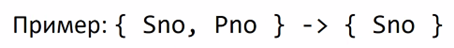

# 3. [Нормализация отношений](#нормализация-отношений). [Концепция нормальных форм](#концепция-нормальных-форм). [Декомпозиция без потерь и функциональные зависимости](#декомпозиция-без-потерь-и-функциональные-зависимости). [Первая, вторая и третья нормальные формы](#первая-вторая-и-третья-нормальные-формы). [Нормальная форма Бойса-Кодда](#нормальная-форма-бойса-кодда)

## Нормализация отношений

**Нормализация отношений БД** – это преобразование их так, чтобы они соответствовали нормальным формам

## Концепция нормальных форм

Виды НФ:

- первая нормальная форма (1НФ или 1NF);
- вторая нормальная форма (2НФ или 2NF);
- третья нормальная форма (3НФ или 3NF);
- нормальная форма Бойса-Кодда (НФБК или BCNF);
- четвертая нормальная форма (4НФ или 4NF);
- пятая нормальная форма, или нормальная форма проекции-соединения (5НФ или 5NF или PJ/NF).

Обычно говорить более чем о 3 НФ + НФ Б-К на практике смысла нет

Свйоства НФ:

- каждая следующая НФ «лучше» предыдущей;
- При переходе к следующей НФ свойства предыдущих нормальных свойств сохраняются.
- Переход к следующей НФ обратим
- Переход к следующей НФ происходит без потери, появления  и искажения данных
- Переход к следующей НФ происходит за счёт декомпозиции отношения на два или более отношений

Цели приведения схемы БД к НФ:

- Исключение некоторых типов избыточности

  Но исключается не вся избыточность, все решается, исходя из конкретной задачи и необходимости соблюдения требований к ресурсам и скорости работы. Если информация избыточна, то это значит, что она задублирована в нескольких местах. А значит, при обновлении может происходить застаривание такой задублированной информации.

- Устранение некоторых [***аномалий обновления***](APPENDIX.md#аномалии-обновления)

  Речь идет о непреднамеренном искажении данных при обновлении. Это происходит из-за особенностей хранения данных

Цели актуальны для OLTP, но не актуальны для OLAP[^1].

## Декомпозиция без потерь и функциональные зависимости

### Декомпозиция

Декомпозиция подразумевает разбиение переменной отношения на другие переменные отношения во время процедуры нормализации. Дкомпозицию проводят, чтобы избежать избыточности и устранить [***аномалии обновления***](APPENDIX.md#аномалии-обновления)

**Декопозиция без потерь** - это декопозиция, при обращении которой отсутствуют потери информации. Интерес представляют только те операции, которые выполняются без потерь (*Дейт*). Декомпозиция - это. по сути, проекция: новые переменные отношения являются проекцией некоей исходной переменной отношения. Если операцией декомпозиции в процедуре нормализации является операция проекции, то обратной операцией (назовем ее рекомпозицией) должна быть операция соединения (*Дейт*)

**Определение**: декомпозиция переменной отношения R на проекции Rl, R2, ..., Rn выполняется без потерь, если R равна соединению Rl, R2, ..., Rn (с учетом необходимых проекций, чтобы избежать избыточности).

### Функциональные зависимости

По *Дейту*: По сути, функциональная зависимость (далее для ее обозначения часто будет использоваться аббревиатура ФЗ) является связью типа "многие к одному" между множествами атрибутов внутри данной переменной отношения

**Определение**: Пусть R – это отношение, а X и Y – произвольные подмножества множества атрибутов отношения R. Тогда Y функционально зависимо от X тогда и только тогда, когда каждое значение множества X связано в точности с одним значением множества Y

Символическая запись: X→Y

Лева часть – **детерминант**, правая – **зависимая часть**.

**Определение № 2**: пусть R(A1, A2, ..., An) - схема отношения. Функциональная зависимость X→Y между двумя наборами аттрибутов X и Y, которые являются подмножествами R, определяет ограничение на возможность существования кортежа в некотором отношнии R. Ограничение означает, что для любых двух кортежей t1 и t2 в R, для которых имеет место t1(X)=t2(X), также имеет место t1(Y)=t2(Y) (*НО НЕ ОБЯЗАТЕЛЬНО, ЧТО СПРАВЕДЛИВО ОБРАТНОЕ!*)

#### **Свойства из определения № 2**

- Если ограничение на схеме отношения R утверждает, что не может быть более одного кортежа со значением атрибутов X в любом отношении экземпляре отношения r, то X является **потенциальным ключом** R. Это означает, что X →Y для любого подмножества атрибутов Y из R. Если X является потенциальным ключом R, то X→R
 - Если X→Y в R, это не означает, что Y→X в R
 - Если переменная-отношение R удовлетворяет ФЗ X→Y и X не является потенциальным ключом, то R будет характеризоваться некоторой избыточностью (в примере выше с SCP - сведения о том, что каждлый поставщик находится в данном городе). Избыточность ведет к [***аномалиям обновления***](APPENDIX.md#аномалии-обновления)

 **Определение Тривиальной ФЗ**: ФЗ (X→Y) тривиальна тогда и только тогда, когда Y является собственным подмножеством X

Пример:

## Первая, вторая и третья нормальные формы

## Нормальная форма Бойса-Кодда

---

## [:back: **К списку вопросов**](../README.md)

---

[^1]: О том, что такое OLTP И OLAP, см. APPENDIX: [OLTP и OLAP](APPENDIX.md#oltp-и-olap)
