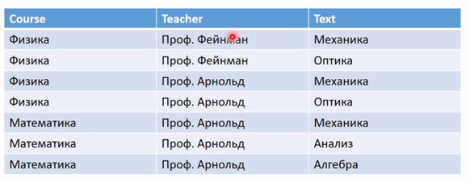
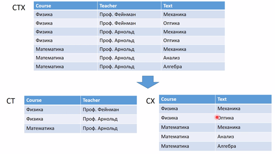
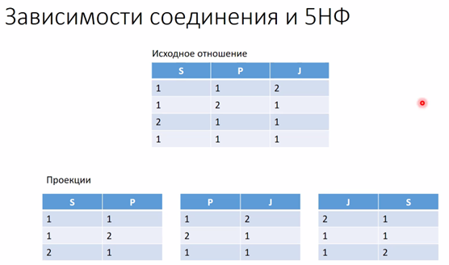
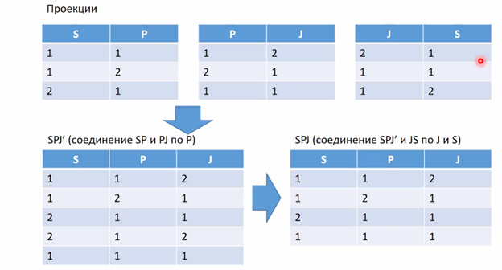

# 4. [Нормализация отношений](#нормализация-отношений). [Многозначные зависимости и четвертая нормальная форма](#многозначные-зависимости-и-четвертая-нормальная-форма). [2-декомпозируемые и n-декомпозируемые отношения. Зависимости соединения и пятая нормальная форма](#2-декомпозируемые-и-n-декомпозируемые-отношения-зависимости-соединения-и-пятая-нормальная-форма)

## Нормализация отношений

См. аналогичный раздел в [Вопросе № 3](03.md#нормализация-отношений)

## Многозначные зависимости и четвертая нормальная форма

### Многозначная зависимость

Пример, на котором строится дальнейшее изложение (переменная отношения CTX):

*Дейт* говорит:

- Многозначную зависимость можно считать обобщением понятия функциональной зависимости в том смысле, что каждая функциональная зависимость является также многозначной зависимостью, но обратное утверждение неверно (поскольку существуют многозначные зависимости, которые не являются функциональными).
- В случае с переменной CTX имеют место следущие многозначные зависимости:
  
  - `COURSE ->-> TEACHER`
  - `COURSE ->-> TEXT`

- Рассмотрим первую из этих зависимостей, `COURSE ->-> TEACHER`. На интуитивном уровне она означает, что, хотя для каждого курса не существует одного соответствующего только ему преподавателя, т.е. не выполняется функциональная зависимость `COURSE -> TEACHER`, каждый курс имеет вполне определенное множество соответствующих преподавателей. Если говорить точнее, под понятием "вполне определенное множество" в нашем случае подразумевается, что для данного курса с и данного учебника х множество преподавателей t, соответствующее паре (с, х) переменной отношения СТХ, зависит только от значения с, поскольку не имеет значения, какой именно учебник х будет выбран. Вторая многозначная зависимость, COURSE →→ TEXT, имеет аналогичную интерпретацию.

**Строгое определение по Дейту**: Пусть R - переменная отношения, а А, B и C являются произвольными подмножествами множества атрибутов переменной отношения R. Тогда подмножество в многозначно зависит от подмножества А, что символически выражается следующей записью `A ->-> B` (читается как "А многозначно определяет B" или "А двойная стрелка B"), тогда и только тогда, когда в каждом допустимом значении R множество значений B, соответствующее заданной паре значений А, C, зависит только от значения А и не зависит от значения C.

Нетрудно показать что для данной переменной отношения `R{A, B, С}` многозначная зависимость `A ->-> B` выполняется тогда и только тогда, когда выполняется также многозначная зависимость `A ->-> C`. Таким образом, многозначные зависимости всегда образуют связанные пары, поэтому обычно их представляют вместе в символическом виде, как показано ниже (т.н. **Лемма Фейгина**).

`A ->-> B | C` (`A ->> B|С` - в лнотации лекции, см. ниже)

Для рассматриваемого примера подобная запись будет иметь следующий вид:

`COURSE ->-> TEACHER | TEXT`

Ранее уже утверждалось, что многозначные зависимости являются обобщениями функциональных зависимостей в том смысле, что каждая функциональная зависимость является многозначной. Точнее говоря, функциональная зависимость — это многозначная зависимость, в которой множество зависимых значений, соответствующее заданному значению детерминанта, всегда является одноэлементным множеством. Таким образом если `A -> B`, то, безусловно, `A ->-> B`

Многозначные зависимости могут стать причиной [**аномалий обновления**](APPENDIX.md#аномалии-обновления)

### 4НФ

**Формальное определение по Дейту (в лекции аналогично, только другая нотация, см. ниже)**: Переменная отношения R находится в четвертой нормальной форме (4НФ) тогда и только тогда, когда в случае существования таких подмножеств А и В атрибутов этой переменной отношения R, для которых выпол няется нетривиальная многозначная зависимость `A ->-> B`, все атрибуты переменной отношения R также функционально зависят от атрибута А.

*(Под тривиальностью многозначной зависимости `A ->-> B` понимается ситуация, когда A является надмножеством B или или объединение AB атрибутов A и B составляет весь заголовок)*

**Неформальное описание 4НФ**. Это можно также сформулировать в следующей эквивалентной форме: переменная отношения R находится в 4НФ тогда и только тогда, когда она находится в НФБК и все многозначные зависимости в переменной отношения R фактически представляют собой функциональные зависимости от ее ключей.

Пример приведение CTX к 4НФ:

#### Определения из лекции

Пусть A, B, C – являются произвольными подмножествами атрибутов переменной отношения R.

Тогда подмножество B многозначно зависит от подмножества A тогда и только тогда, когда множество значения B, соответствующее заданной паре (значение A, значение C) переменной-отношения R, зависит от A, но не зависит от C.

Обозначение: `A ->> С`

Применительно к примеру CTX предположим, что A - это COURSE, а C - это TEXT, тогда B - это TEACHER. Из CTX видно, что B функционально зависит от A, но не зависит от C. Следовательно, нужно произвести декомпозицию

**Теорема Фейгина**: пусть A, B, C являются мнодествами атрибутов переменной-отношения `R(A, B, C)`. Переменная-отношение R будет равна соединению ее проекций `{A,B}` и `{A,C}` тогда и только тогда, когда для переменной-отношения R выполняется `A ->> B|С`

## 2-декомпозируемые и n-декомпозируемые отношения. Зависимости соединения и пятая нормальная форма

### 2-декомпозируемые и n-декомпозируемые отношения

До 4НФ включительно единственной операцией, необходимой для устранения избыточности в отношении, была декомпозиция его на две проекции. Однако, существуют отношения, для которых нельзя выполнить декомпозицию без потерь на две проекции, но которые можно подвергнуть декомпозиции без потерь на три (или более) проекций. Этот факт получил название зависимости по соединению, а такие отношения называют 3-декомпозируемые отношения (ясно, что любое отношение можно назвать "n-декомпозируемым", где n >= 2)[^1].

### Зависимости соединения и пятая нормальная форма

**Зависимости соединения**: пусть R является переменной-отношением, а A, B, C, ..., Z - произвольными пдмножествами множества ее атрибутов. Переменная отношения R удовлетворяет зависимости соединений `*{A,B,C,...,Z}` тогда и только тогда, когда любое допустимое значение переменной-отношения R эквивалентно соединению ее проекций по подмножествам аттрибутов A, B, C, ..., Z.

Пример разбиения отношения на ЗС и соединения полученных проекций (SPJ удовлетворяет ЗС `*{SP, PJ, JS}`):

**Тривиальная ЗС**: ЗС `*{A,B,C,...,Z}` называется тривиальной тогда и только тогда, когда одна из проекций A, B, C, ..., Z является проекцией, идентичной R (т.е. проекцией по всем атрибутам переменной отношения R)

ЗС `*{A,B,C,...,Z}` подразумевается потенциальными ключами тогда и только тогда, когда каждое подмножество атрибутов A, B, C, ..., Z фактически является [**суперключем**](01.md#потенциальный-первичный-и-альтернативный-ключи) для данной переменной отношения

**Определение 5НФ**: Переменная отношения R находится в 5НФ или *Проекционно-соединительной НФ* тогда и только тогда, когда каждая нетривиальная ЗС в переменной отношения R подразумевается ее потенциальными ключами

---

## [:back: **К списку вопросов**](../README.md)

---

[^1]: Взято [здесь](http://www.mstu.edu.ru/study/materials/zelenkov/ch_4_2.html)
