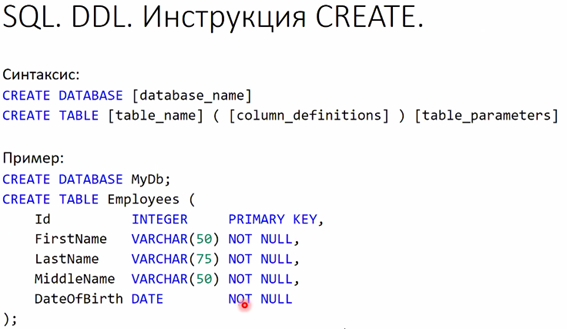
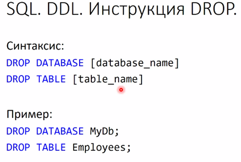
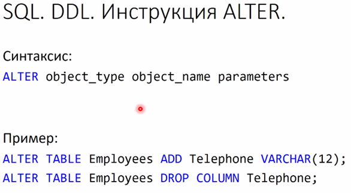
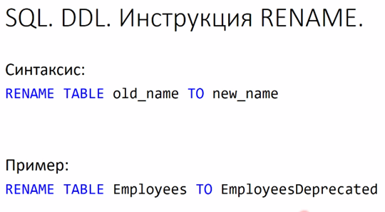
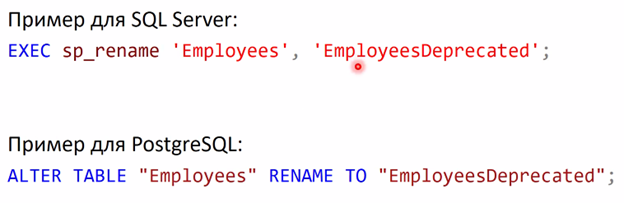
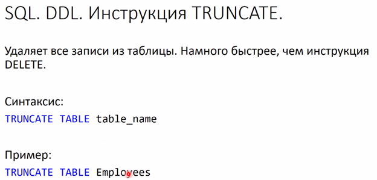

# 5. [Язык SQL](#язык-sql). [DDL](#ddl). [Объекты РБД: таблицы](#объекты-рбд-таблицы). [Синтаксис создания таблиц на примере произвольного диалекта SQL. Указание первичных и внешних ключей, обязательности значений, значений по умолчанию, а также других видов ограничений. Создание автоматически генерируемого значения для первичного ключа](#синтаксис-создания-таблиц-на-примере-произвольного-диалекта-sql-указание-первичных-и-внешних-ключей-обязательности-значений-значений-по-умолчанию-а-также-других-видов-ограничений-создание-автоматически-генерируемого-значения-для-первичного-ключа). [Рекомендации при проектировании таблиц в РБД](#рекомендации-при-проектировании-таблиц-в-рбд2)

## Язык SQL

### История

Это язык запросов, который используется во всех и ни в каких реляционных СУБД. Почему ни в каких? Потому что по факту в чистом виде его никто не реализует, но реализуют его диалекты, которые очень на него похоже. Дело в том, что на практике есть более широкий круг задач, которые надо решать.

- В начале 1970-х Э.Ф. Кодд, работавший в IBM, разработал теорию РБД
- Для воплощения идей РМД он разработал язык – Alpha
- Разработку передали группу, неподконтрольной Кодду
- Нарушив некоторые принципы РМ, она была реализована в экспериментальной СУБД IMB System R
- Для IBM System R был разработан специальный язык SEQUEL (Structured English Query Language)
- Поскольку SEQUEL был зарегистрированной ТМ, название стандарта сократили до  SQL
- Сейчас SQL реализован во всех СУРБД
- Ни в одной СУРБД SQLне реализован в чистом виде – в каждой какой-то свой диалект

### Стандартизация

- Стандарт ISO/IEC 9075 “Database Language SQL”
- Первая – 1986 г.
- Наиболее свежая версия – 2016 г

Стандарт включает 9 разделов (на примере стандарта 2008 года из Вики):

1. 9075-1, SQL/Framework;
2. 9075-2, SQL/Foundation;
3. 9075-3, SQL/CLI; (call level interface – спецификация интерфейса уровня вызова)
4. 9075-4, SQL/PSM; (persistent stored modules – спецификация хранимых процедур)
5. 9075-9, SQL/MED; (management of external data – управление внешними данными)
6. 9075-10, SQL/OLB; (связывание с объектно-ориентированными языками программирования)
7. 9075-11, SQL/Schemata; (средства самоописания[^1])
8. 9075-13, SQL/JRT; (Java runtime – использование  подпрограмм и типов SQL в языке программирования Java)
9. 9075-14, SQL/XML. (спецификации языковых средств, позволяющих работать с XML-документами в среде SQL)

### Характеристики

- Декларативный (то есть на этом языке можно выразить то, что нужно в итоге получить, но не то, что нужно сделать; это альтернатива императивному языку, в котором говорится, как нужно сделать что-то) с элементами процедурного, с сильной статической типизацией
- Расширение файлов (чаще всего): “.sql”
- Нечувствительный к регистру
- Чаще всего синтаксические конструкции пишут в верхнем регистре, а имена – согласно соглашению именования в команде

### Диалекты

Стандарт реализован в различных СУБД в виде диалектов, расширяющих стандарт:

- Transact-SQL или T-SQL в Microsoft SQL Server
- PL/pgSQL в PostgreSQL
- PL/SQL в Oracle
- SQL/PSM в MySQL
- SQL PL в IBM DB2
- SPL в IBM Informix
- И т.д.

### Виды конструкций языка

Условно конструкции SQL можно разделить на три группы:

- **Data definition Language (DDL)**

  Объявление данных, создание объектов БД, ключи, индексы

- **Data manipulation Language (DML)**
  
  Операции над данными: CRUD – создание, чтение, редактирование, удаление

- **Data Control Language (DCL)**
  
  Это управление правами доступа. Контроль за данными

## DDL

SQL. Data definition language (DDL):

- CREATE – создает объект БД (саму  БД, таблицу, представление, хранимую процедуру, функцию и т.д.). Дальнейший синтаксис после слова CREATE отличается в зависимости от того, что создается
- DROP – удаление существующего объекта. Почему не DELETE? Дело в том что это слово зарезервировано в DML для удаления строк таблиц.
- ALTER – изменяет существующий объект. Добавление нового столбца таблицы, изменение хранимой процедуры
- RENAME – переименование таблицы в БД. Далеко не все СУБД поддерживают эту инструкцию
- TRUNCATE – удаляет все строки в таблице. Почему это не DML? Да, в DML есть DELETE. Разница между этими двумя операторами заключается в том, что при DELETE можно накладывать условие, а при TRUNCATE удаляется всегда все строки таблицы. Также TRUNCATE не попадает в журнал транзакций, а DELETE – попадает.

**Примеры синтаксиса:**

## Объекты РБД: таблицы

Совокупность связанных данных, хранящихся в БД в структурированном виде. С точки зрения РМД таблица представляет собой выражение некоего отношения (но не всегда точное выражение, т.к. в таблице могут содержаться повторяющиеся данные). С этой точки зрения можно провести такое споставление:

- заголовок таблицы - это схема отношения
- столбцы - это атрибуты, которые могут принимать значения из определенных доменов. Количество столбцов - это мощность отношения
- строки - это кортежи. Количество строк - это кардинальность отношения.

Подробнее по РМД см. Ворпрос № 1: [Реляционная модель](01.md#реляционная-модель)

## Синтаксис создания таблиц на примере произвольного диалекта SQL. Указание первичных и внешних ключей, обязательности значений, значений по умолчанию, а также других видов ограничений. Создание автоматически генерируемого значения для первичного ключа

### Синтаксис создания таблиц

Синтаксис создания таблицы см. выше в разделе ["DDL"](#ddl)

Синтаксис создания подробно применительно к PostrgeSQL см.:

- Документация PostgreSQL. [Раздел 2.3. Создание таблицы](https://postgrespro.ru/docs/postgrespro/9.5/tutorial-table)
- Документация PostgreSQL. [Раздел 5.1. Основы таблицы](https://postgrespro.ru/docs/postgrespro/9.5/ddl-basics)
- Документация PostgreSQL. [CREATE TABLE](https://postgrespro.ru/docs/postgrespro/9.5/sql-createtable)

### Указание первичных и внешних ключей, обязательности значений, значений по умолчанию, а также других видов ограничений

Синтаксис для PostgreSQL:

- Документация PostgreSQL. [Раздел 5.3.4. Первичные ключи](https://postgrespro.ru/docs/postgrespro/9.5/ddl-constraints#ddl-constraints-primary-keys)
- Документация PostgreSQL. [Раздел 5.3.5. Внешние ключи](https://postgrespro.ru/docs/postgrespro/9.5/ddl-constraints#ddl-constraints-fk)
- Документация PostgreSQL. [Раздел 5.3.2. Ограничения NOT NULL](https://postgrespro.ru/docs/postgresql/9.5/ddl-constraints#idp7)
- Документация PostgreSQL. [Раздел 5.2. Значения по умолчанию](https://postgrespro.ru/docs/postgrespro/9.5/ddl-default)
- Документация PostgreSQL. [Раздел 5.3. Ограничения](https://postgrespro.ru/docs/postgrespro/9.5/ddl-constraints)

### Создание автоматически генерируемого значения для первичного ключа

Синтаксис для PostgreSQL:

- Документация PostgreSQL. [Раздел 5.2. Значения по умолчанию](https://postgrespro.ru/docs/postgrespro/9.5/ddl-default)
- Документация PostgreSQL. [Раздел 5.3. Ограничения](https://postgrespro.ru/docs/postgrespro/9.5/ddl-constraints)
- Документация PostgreSQL. [Раздел 8.1.4. Последовательные типы](https://postgrespro.ru/docs/postgresql/12/datatype-numeric#DATATYPE-SERIAL)

## Рекомендации при проектировании таблиц в РБД[^2]

Нормальные формы – это рекомендации по проектированию баз данных. Вы не обязаны придерживаться всех пяти нормальных форм при проектировании баз данных. Тем не менее, рекомендуется нормализовать базу данных в некоторой степени потому, что этот процесс имеет ряд существенных преимуществ с точки зрения эффективности и удобства обращения с вашей базой данных.

- В нормализованной структуре базы данных вы можете производить сложные выборки данных относительно простыми SQL-запросами.
- Целостность данных. Нормализованная база данных позволяет надежно хранить данные.
- Нормализация предотвращает появление избыточности хранимых данных. Данные всегда хранятся только в одном месте, что делает легким процесс вставки, обновления и удаления данных. Есть исключение из этого правила. Ключи, сами по себе, хранятся в нескольких местах потому, что они копируются как внешние ключи в другие таблицы.
- Масштабируемость – это возможность системы справляться с будущим ростом. Для базы данных это значит, что она должна быть способна работать быстро, когда число пользователей и объемы данных возрастают. Масштабируемость – это очень важная характеристика любой модели базы данных и для РСУБД.

---

## [:back: **К списку вопросов**](../README.md)

---

[^1]: См. подробнее [википедию](https://ru.wikipedia.org/wiki/SQL/Schemata)
[^2]: Взято на [хабре](https://habr.com/ru/post/193756/)
