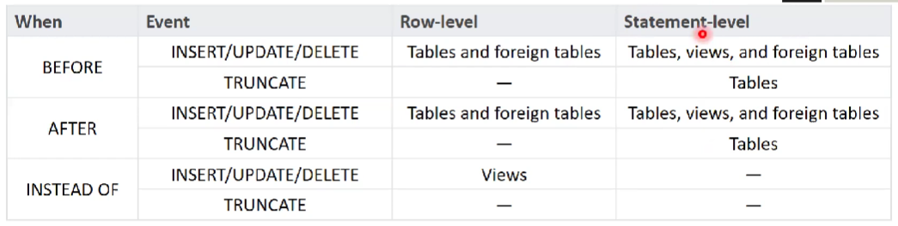

# 8. [Язык SQL](#язык-sql). [DDL](#ddl). [Объекты РБД: триггеры](#объекты-рбд-триггер). [Синтаксис создания триггеров на примере произвольного диалекта SQL. Виды триггеров. Работа с изменёнными данными в триггерах](#синтаксис-создания-триггеров-на-примере-произвольного-диалекта-sql-виды-триггеров-работа-с-изменёнными-данными-в-триггерах)

## Язык SQL

См. Вопрос 5: [Язык SQL](05.md#язык-sql)

## DDL

См. Вопрос 5: [DDL](05.md#ddl)

## Объекты РБД: триггер

Это функции, которые вызываются автоматически в ответ на некоторое событие из жизни определенной таблицы. Есть еще тип триггеров, которые реагируют на события уровня БД.

См. документацию по триггерам:

- Документация PostgreSQL. [Глава 39. Триггеры](https://postgrespro.ru/docs/postgresql/14/triggers)
- Документация PostgreSQL. [Глава 40. Триггеры событий](https://postgrespro.ru/docs/postgresql/14/event-triggers)

События, обрабатываемые триггерами:

- `INSERT`
- `UPDATE`
- `DELETE`
- `TRUNCATE`

Варианты запуска триггеров по времени:

- `BEFORE`
- `AFTER`
- `INSTEAD OF`

Варианты запуска триггеров по порции изменений:

- `FOR EACH ROW` - для каждого ряда. Например, при удалении 10 записей триггер вызовется 1 раз
- `FOR EACH STATEMENT` - для каждой инструкции. При удалении 10 записей триггер вызовется всего 1 раз

*`INSTEAD OF` полезен только для случаев, когда представление **не** удовлетворяет требованиям [обновляемого представления](06.md#синтаксис-создания-представлений-на-примере-произвольного-диалекта-sql). Иначе в самом представлении можно реализовать всю необходимую логику*

Возможно создание нескольких триггеров на одно событие одной таблицы. В этом случае они будут выполнены в алфавитном порядке.

**Рекомендация**: лучше по возможности меньше пользоваться триггером. В противном случае можно выстрелить себе в ногу и тогда придется отлаживать фактически событийную логику. А такую логику отлаживать очень сложно.

## Синтаксис создания триггеров на примере произвольного диалекта SQL. Виды триггеров. Работа с изменёнными данными в триггерах

### Синтаксис

См.: Документация PostgreSQL. [CREATE TRIGGER](https://postgrespro.ru/docs/postgresql/14/sql-createtrigger)

### Виды тригеров

- Триггеры на события таблицы (см [выше](#объекты-рбд-триггер))
- Event triggers (ПАА называет из триггерами DDL, так как они реагируют на DDL-вещи)

### Event triggers (триггеры DDL)

Эти триггеры регистрируются не на какую-то конкретную таблицу, а на любой объект в БД

- Документация PostgreSQL. [Глава 40. Триггеры событий](https://postgrespro.ru/docs/postgresql/14/event-triggers)

Обрабатывают события БД:

- `ddl_command_start`

  Возникает перед выполнением `CREATE`, `ALTER`, `DROP`, `SECURITY LABEL`, `COMMENT`, `GRANT` или `REVOKE`.

- `ddl_command_end`

  Возникает после выполнения `CREATE`, `ALTER`, `DROP`, `SECURITY LABEL`, `COMMENT`, `GRANT` или `REVOKE`.

  Детали изменений можно узнать вызвав функцию `pg_event_trigger_ddl_commands()`

- `table_rewrite` (изменение схемы таблицы)

  Возникает перед выполнением `ALTER TABLE` или `ALTER TYPE`.

- `sql_drop`

  Возникает перед `ddl_command_end` при удалении объектов БД

### Синтаксис event triggers

См.: Документация PostgreSQL. [CREATE EVENT TRIGGER](https://postgrespro.ru/docs/postgresql/14/sql-createeventtrigger)

По триггер-функциям из примера в документации см. также APPENDIX: [Триггер функции](APPENDIX.md#триггер-функции)

### Работа с измененными данными в триггерах

См. разделы документации PostgreSQL:

- [39.1. Обзор механизма работы триггеров](https://postgrespro.ru/docs/postgresql/14/trigger-definition)
- [39.2. Видимость изменений в данных](https://postgrespro.ru/docs/postgresql/14/trigger-datachanges)

---

## [:back: **К списку вопросов**](../README.md)

---
