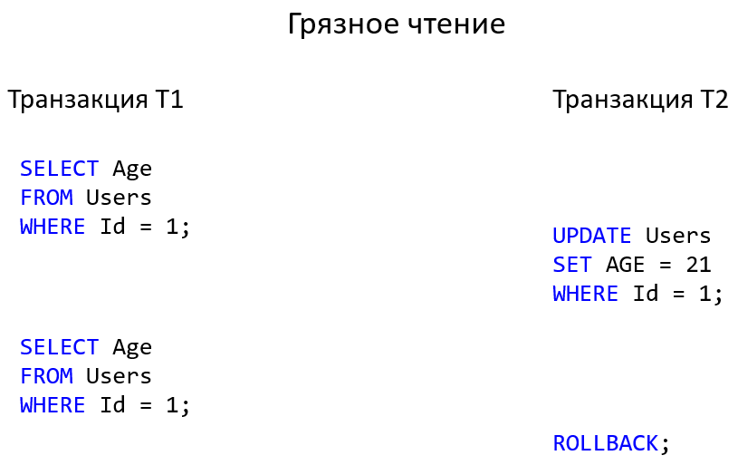
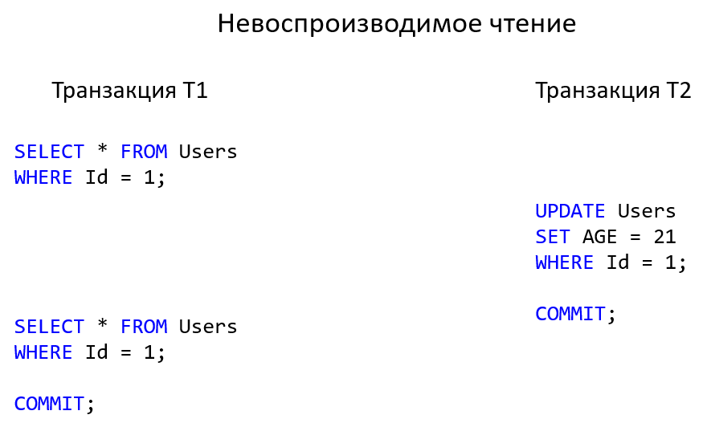
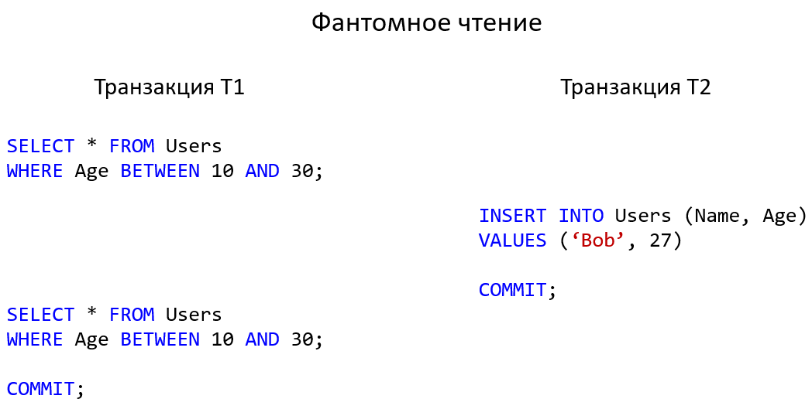
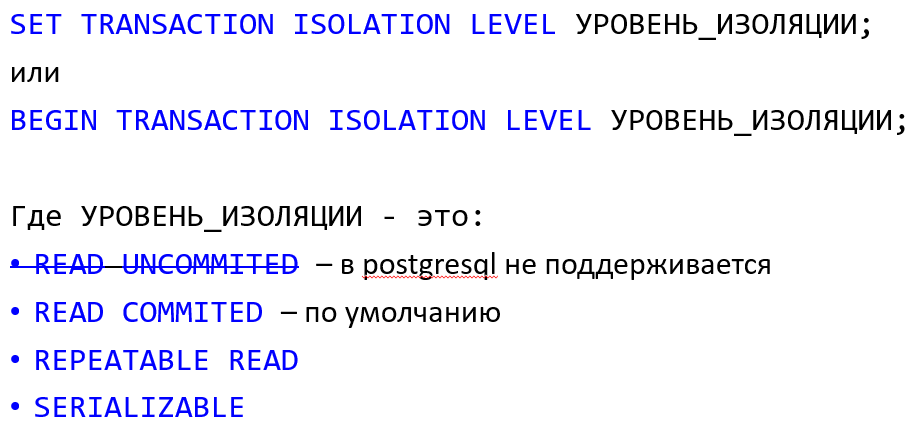
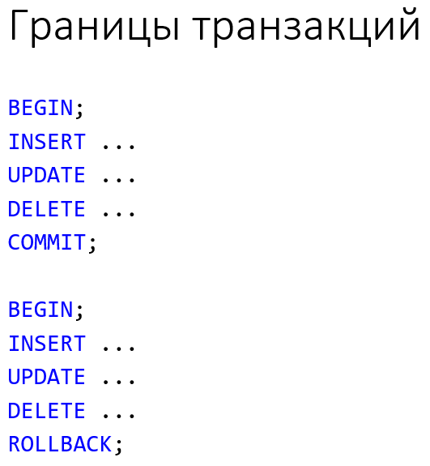

# 14. [Транзакции в СУРБД](#транзакции-в-сурбд). [Свойства транзакций (ACID). Изоляция транзакций](#свойства-транзакций-acid-изоляция-транзакций). [Классификация проблем одновременного доступа к данным при отсутствии блокировок](#классификация-проблем-одновременного-доступа-к-данным-при-отсутствии-блокировок). [Уровни изоляции транзакций](#уровни-изоляции-транзакций). [Способы определения границ транзакций на примере T-SQL](#способы-определения-границ-транзакций-на-примере-t-sql-а-также-на-примере-postgres)

## Транзакции в СУРБД

**Транзакция** – это объект, группирующий последовательность операций, которые должны быть выполнены как единое целое. Обеспечивает переход БД из одного целостного состояния в другое.

В качестве примера транзакции рассмотрим последовательность операций по приему заказа в коммерческой компании.

Для приема заказа от клиента приложение ввода заказов должно:

- выполнить запрос к таблице товаров и проверить наличие товара на складе;
- добавить заказ к таблице счетов;
- обновить таблицу товаров, вычтя заказанное количество товаров из количества товара, имеющегося в наличии;
- обновить таблицу продаж, добавив стоимость заказа к объему продаж служащего, принявшего заказ;
- обновить таблицу офисов, добавив стоимость заказа к объему продаж офиса, в котором работает данный служащий.

Транзакции обеспечивают целостность БД в условиях:

- Параллельной обработки данных
- Физических отказов диска
- Аварийного сбоя электропитания
- И других

## Свойства транзакций (ACID). Изоляция транзакций

1. Atomic – атомарные;
2. Consistent – согласованные;
3. Isolated – изолированные;
4. Durable – долговечные, устойчивые.

### Атомарность

Транзакция должна представлять собой атомарную (неделимую) единицу работы. Должны быть выполнены либо все операции, входящие в транзакцию, либо ни одна из них. Следовательно, в случае невозможности выполнить все операции, все внесённые изменения должны быть отменены:

- Commit – совершение транзакции
- Rollback – отмена транзакции

### Согласованность

По завершению транзакции все данные должны остаться в согласованном состоянии. При выполнении транзакции необходимо выполнить все правила реляционной СУБД:

- Проверки выполнения ограничений (домены, индексы уникальности, внешние ключи, проверки, правила и т.д.)
- Обновление индексов;
- Выполнение триггеров
- И другие

### Изоляция

Изменения в данных, выполняемые в пределах транзакции, должны быть изолированы от всех изменений, выполняемых в других транзакциях, до тех пор, пока транзакция не совершена. Выделяют различные уровни изоляции – для достижения компромисса между степенью распараллеливания работы с БД и строгостью выполнения принципа непротиворечивости:

- Чем выше уровень изоляции, тем выше степень непротиворечивости данных;
- Чем выше уровень изоляции, тем ниже степень распараллеливания и тем ниже степень доступности данных.

### Долговечность, устойчивость

- Если транзакия была совершена, её результат должен сохраниться в системе, несмотря на сбой системы.
- Если транзакиция не была совершена, её результат может быть полностью отменён вслед за сбоем системы.

## Классификация проблем одновременного доступа к данным при отсутствии блокировок

Стандартная классификация проблем с уровнями изоляции:

- P1: dirty read – «грязное» чтение
- P2: non-repeatable read – невоспроизводимое чтение
- P3: phantom read – фантомное чтение

### P1: dirty read – «грязное» чтение

1. Транзакция Т2 вносит изменения в ряд таблицы.
2. Т1 читает этот ряд после внесения изменений Т2, но до совершения Т2.
3. Если Т2 будет отменена, то данные, считанные Т1, будут некорректными.

### P2: non-repeatable read – невоспроизводимое чтение

1. Транзакция Т1 читает ряд.
2. Транзакция Т2 после этого вносит изменения в этот ряд или удаляет его.
3. Если Т1 после этого читает этот же ряд снова, то получит новый результат по сравнению с первым считыванием.

### P3: phantom read – фантомное чтение

1. Транзакция Т1 читает набор рядов N, удовлетворяющих некоторому условию.
2. После этого Т2 выполняет SQL запросы, создающие новые ряды, удовлетворяющие этому условию.
3. Если Т1 повторит запрос с тем же условием, то получит другой набор рядов.

## Уровни изоляции транзакций

|Уровень изоляции|Грязное чтение|Невоспроизводимое чтение|Фантомное чтение|
|-|-|-|-|
|0. Read uncommited[^*]|возможно|возможно|возможно|
|1. Read commited|-|возможно|возможно|
|2. Repeatble read|-|-|возможно|
|3. Serializable|-|-|-|

[^*]: В Postgres не поддерживается, фактически совпадает с уровнем read commited

Характеристики:

- Выбор уровня изоляции транзакции влияет только на чтение
- Модификация данных всегда использует монопольную блокировку
- Монопольная блокировка удерживается до конца транзакции
- Чем ниже уровень изоляции, тем выше достижимая степень параллелизма, но тем больше возникает эффектов параллелизма и хуже согласованность данных
- Чем выше уровень изоляции тем лучше согласованность данных, но ниже степень параллелизма и выше шанс возникновения взаимных блокировок

Подробнее по терминологии и реализации в Postgres см. [документацию Postgres](https://postgrespro.ru/docs/postgresql/10/transaction-iso)

### Установка уровня изоляции

Свойства инструкции:

- Уровень изоляции настраивается для текущей транзакции
- Уровни изоляции транзакции определяют тип блокировок, применяемый к операциям считывания
- Устанавливать уровень изоляции необходимо перед каким-либо запросом

### Read commited

Оператор может видеть только строки, зафиксированные до его начала

### Repeatble read

Все операторы текущей транзакции могут видеть только строки, зафиксированные до того, как в этой транзакции был выполнен первый запрос или оператор изменения данных.

В postgresql на этом уровне также запрещает фантомное чтение.

### Serializable

Все операторы текущей транзакции могут видеть только строки, зафиксированные до того, как в этой транзакции был выполнен первый запрос или оператор изменения данных.

Если последовательность операций чтения и записи среди параллельных сериализуемых транзакций создаст ситуацию, которая не могла бы возникнуть ни при каком последовательном (по одному) выполнении этих транзакций, одна из них будет отменена с ошибкой serialization_failure.

## Способы определения границ транзакций на примере T-SQL (а также на примере Postgres)

### Границы тразакций в MS SQL Server

[T-SQL (Transact-SQL)](https://ru.wikipedia.org/wiki/Transact-SQL) - процедурное расширение языка SQL, созданное компанией Microsoft (для Microsoft SQL Server) и Sybase (для Sybase ASE). Язык Transact-SQL является ключом к использованию MS SQL Server

SQL Server работает в перечисленных ниже режимах транзакций[^1].

- Автоматическое принятие транзакций. Каждая отдельная инструкция является транзакцией.
- Явные транзакции. Каждая транзакция явно начинается с инструкции BEGIN TRANSACTION и явно заканчивается инструкцией COMMIT или ROLLBACK.
- Неявные транзакции. Новая транзакция неявно начинается, когда предыдущая транзакция завершена, но каждая транзакция явно завершается инструкцией COMMIT или ROLLBACK.

### Границы транзакций в Postgres[^2]

:back: [**К списку вопросов**](../README.md)

---

[^1]: [https://docs.microsoft.com/ru](https://docs.microsoft.com/ru-ru/sql/t-sql/language-elements/transactions-transact-sql?view=sql-server-ver15)
[^2]: [https://postgrespro.ru/docs](https://postgrespro.ru/docs/postgrespro/10/tutorial-transactions)
