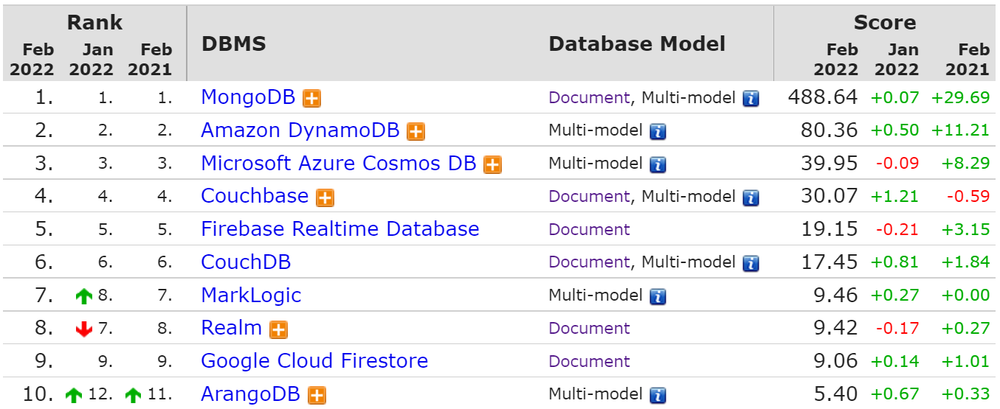
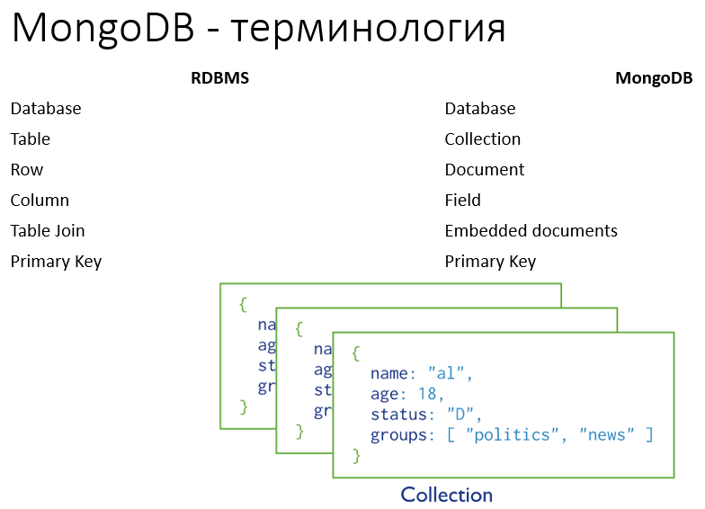
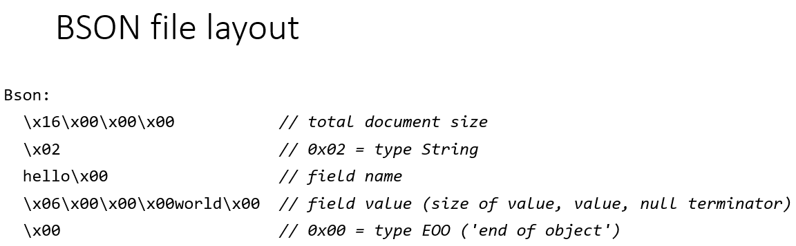
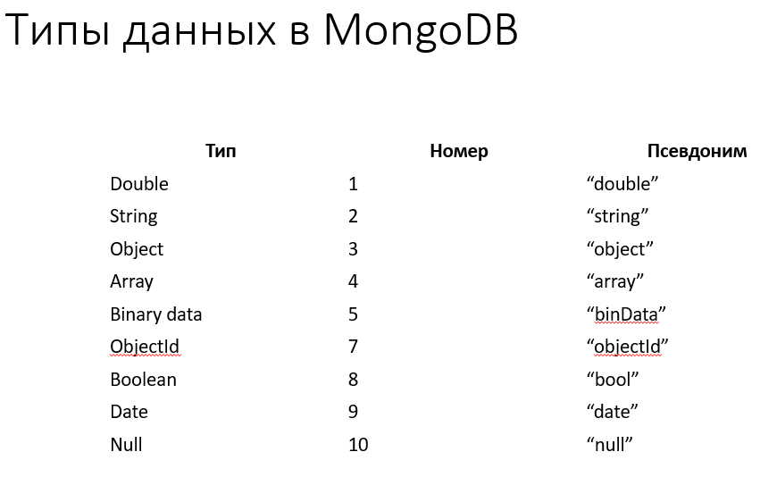
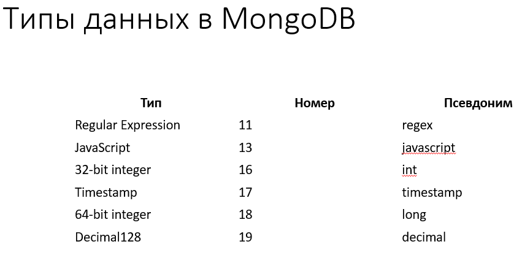

# 18. [Документоориентированные СУБД: примеры](#документоориентированные-субд-примеры). [CAP-теорема (теорема Брюера)](#cap-теорема-теорема-брюера). [ACID и BASE как следствия теоремы Брюера](#acid-и-base-как-следствия-теоремы-брюера). [Модель "согласованность в конечном счёте": что означает, примеры применения, достоинства и недостатки](#модель-согласованность-в-конечном-счёте-что-означает-примеры-применения-достоинства-и-недостатки)

## Документоориентированные СУБД: примеры

### MongoDB

- NoSQL документоориентированная СУБД
- Февраль 2009 – первая версия
- Исходный код: [https://github.com/mongodb/mongo](https://github.com/mongodb/mongo)
- Поддержка ОС: Windows Vista+, Linux, OS X 10.7+, Solaris, FreeBSD
- Возможности:
  - Запросы
  - Индексация
  - Репликация
  - Балансировка нагрузки
  - Файловое хранилище
  - Агрегация данных

    По сути, речь про аналог JOIN-запросов в РСУБД

  - Исполнение JavaScript на сервере

    В качестве языка запросов используется что-то JS-подобное

  - Коллекции с фиксированным размером

    Это ограниченные по объему коллекции, в которых старые записи перезаписываются по кругу

  - Транзакции в пределах одного документа

    Транзакционная целостность поддерживается только в пределах одного документа

  - Междокументные транзакции (версия 4.0, июнь 2018)

    Относительно новая фича со своими нюансами

Embededded documents - речь про то, что мы можем не использовать JOIN, а хранить данные внутри документа более общего, включать один документ в другой

Формат хранения и передачи данных – BSON (бинарный JSON)

Тип ObjectId:

- 12-байтовое 16-ричное число
- Генерируется автоматически при вставке документа или указывается клиентом
- Автогенерируемое значение:
  - 4 байта – текущее время (unix время, в секундах)
  - 5 байт – случайное значение
  - 3 байта – автоматически инкрементируемый счётчик, инициализируемый случайным значением
- Используется в качестве идентификатора документа – поле “_id”
- Последовательность “_id” не гарантирована в пределах секунды

String – строка в кодировке UTF-8

Timestamp – 64-битное значение, уникальное в пределах процесса mongod, где:

- Первые 32 бита – значение time_t (кол-во секунд с начала эпохи Unix (1 января 1970))
- Вторые 32 бита – инкрементируемое значение для операций в пределах секунды

Date – 64-битное целое, представляющее собой кол-во миллисекунд с начала эпохи Unix (1 января 1970)

### Firebase Realtime Database

- База данных в составе платформы Firebase
- Предоставляется как облачный сервис по схеме SaaS, недоступна для разворачивания на своих серверных мощностях
- Документная СУБД
  
  Другой принцип: вместо коллекций с документами там иерархия документов, которая сама является документом

- Событийный механизм реакции на изменения данных в БД
  
  Можно подписаться на изменение на каком-то уровне иерархии документов. На уровне клиетских приложений это может очень удачно интегрироваться в клиентские приложения

- Клиентские библиотеки на Web (js), iOS, Android, C++, Unity
- Позволяет разрабатывать приложения на бессерверной архитектуре (backendless): БД <-> Клиенты, где клиенты – это мобильные приложения или веб страницы.
- Поддерживает гибкий механизм настройки безопасности

### Elasticsearch

- Позиционируется как поисковая система, а не как СУБД
  
  Как правило используется в [ELK-стеке](https://aws.amazon.com/ru/opensearch-service/the-elk-stack/)

- Поиск производится по так называемым «индексам»
- «Индекс» в Elasticsearch по всем признакам похож на коллекция документов в MongoDB
- Elasticsearch поддерживает репликацию и шардирование до сетей размером в 300 узлов

  Масштабировать удобнее, чем, напр., Postgres

- Поддерживает полнотекстовый поиск
- Имеет HTTP интерфейс – доступна для запросов из любого языка

Так или иначе использовать Elastic как самостоятельую БД не стоит, это в первую очередь поисковый движок. Elastic лучше использовать в совокупности полноценной СУБД (напр., его используют в качестве индексов)

## CAP-теорема (теорема Брюера)

## ACID и BASE как следствия теоремы Брюера

## Модель "согласованность в конечном счёте": что означает, примеры применения, достоинства и недостатки

### Понятие распределенной системы и модели согласованности

**Распределенная система** - на базовом уровне это совокупность ЭВМ, подключенных к единой сети, которые работают вместе, образуя единую машину для конечного пользователя. Все эти распределенные машины имеют одно общее состояние и работают одновременно. Применительно к **БД** - это база данных, составные части которой размещаются в различных узлах компьютерной сети в соответствии с каким-либо критерием.

[**Модель согласованности**](https://ru.wikipedia.org/wiki/%D0%9C%D0%BE%D0%B4%D0%B5%D0%BB%D1%8C_%D1%81%D0%BE%D0%B3%D0%BB%D0%B0%D1%81%D0%BE%D0%B2%D0%B0%D0%BD%D0%BD%D0%BE%D1%81%D1%82%D0%B8) - это подход, используемый в той или иной распределённой системе (распределённой общей памяти, **СУБД**, файловой системе), для обеспечения гарантий согласованности данных.

### "Согласованность в конечном счете" (eventual consistency)[^1]

Это одна из моделей согласованности, используемая в распределённых системах для достижения высокой доступности, в рамках которой гарантируется, что в отсутствие изменений данных, через какой-то промежуток времени после последнего обновления ("в конечном счёте") все запросы будут возвращать последнее обновлённое значение. Реализует оптимистичную репликацию[^2].

Простыми словами - изменения применяются гарантированно, но с возможной задержкой (асинхронно).

**Пример**: DNS. Обновлённая DNS-запись распространяется по серверам в соответствии с настройками интервалов кэширования и, хоть и не моментально, но в конечном счёте все клиенты увидят обновление.

**Достоинства и недостатки** вытекают из всего вышесказанного. Далее также приведем недостатки NoSQL модели, которые указаны в 11 лекции (поскольку они явлются производными от решения отказаться от ACID-архитектуры, что влечет в том числе использование eventual consistency).

Недостатки:

- Не заставляют проектировать схему предметной области
- Поощряют накопление несогласованной информации в БД
- Для сложных предметных областей: схема данных стремится к реляционной. При этом преимущества реляционной модели остаются недоступными
- Согласованность в конечном счёте и BASE-принцип вносят риски ошибок

---

[^1]: См. подробнее:

- [https://ru.wikipedia.org/wiki/%D0%A1%D0%BE%D0%B3%D0%BB%D0%B0%D1%81%D0%BE%D0%B2%D0%B0%D0%BD%D0%BD%D0%BE%D1%81%D1%82%D1%8C_%D0%B2_%D0%BA%D0%BE%D0%BD%D0%B5%D1%87%D0%BD%D0%BE%D0%BC_%D1%81%D1%87%D1%91%D1%82%D0%B5](https://ru.wikipedia.org/wiki/%D0%A1%D0%BE%D0%B3%D0%BB%D0%B0%D1%81%D0%BE%D0%B2%D0%B0%D0%BD%D0%BD%D0%BE%D1%81%D1%82%D1%8C_%D0%B2_%D0%BA%D0%BE%D0%BD%D0%B5%D1%87%D0%BD%D0%BE%D0%BC_%D1%81%D1%87%D1%91%D1%82%D0%B5)
- [https://en.wikipedia.org/wiki/Eventual_consistency](https://en.wikipedia.org/wiki/Eventual_consistency)

[^2]: **Optimistic replication**, also known as lazy replication, is a strategy for replication, in which replicas are allowed to diverge.

Traditional pessimistic replication systems try to guarantee from the beginning that all of the replicas are identical to each other, as if there was only a single copy of the data all along. Optimistic replication does away with this in favor of eventual consistency, meaning that replicas are guaranteed to converge only when the system has been quiesced for a period of time. As a result, there is no longer a need to wait for all of the copies to be synchronized when updating data, which helps concurrency and parallelism. The trade-off is that different replicas may require explicit reconciliation later on, which might then prove difficult or even insoluble.
See also: [https://en.wikipedia.org/wiki/Optimistic_replication](https://en.wikipedia.org/wiki/Optimistic_replication)
