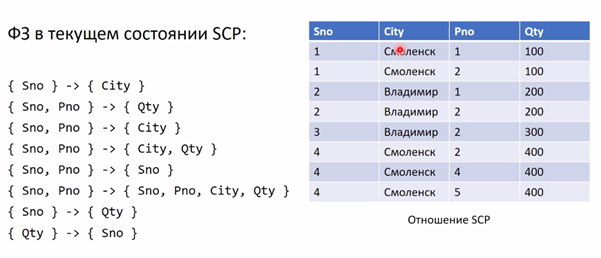
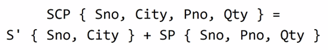

# Дополнительные материалы и уточнения, не вошедшие в список вопросов

## Управление параллелизмом

### Пессиместическое

Характеристики:

- Система блокировок не допускает, чтобы изменение данных одними пользователями влияло на других пользователей.
- После выполнения действия, ведущего к установке блокировки, другие пользователи не могут выполнять действия, конфликтующие с блокировкой пока её владелец не снимет её
- Используется в системах с высокой конкуренцией за данные, где затраты на защиту данных с помощью блокировок меньше затрат на откат транзакций в случае конфликтов параллелизма.

### Оптимистическое

Характеристики:

- Данные не блокируются на период чтения
- Когда пользователь обновляет данные, система проверяет, вносил ли другой пользователь в них изменение после считывания.
- Если другой пользователь изменял данные, возникает ошибка.
- При получении ошибки, как правило, требуется повторить операцию заново
- Используется в системах с низкой конкуренцией за данные, где затраты на периодический откат транзакции меньше затрат на блокировку данных при считывании.

### Реализация управления параллелизмом

- Блокировки – для пессимистического. Реализуются в СУБД

  - Транзакция может запрашивать блокировки различных ресурсов: строк, страниц, таблиц
  - Блокировка не дает другим транзакциям изменять ресурсы
  - Блокировка снимается после завершения транзакции

- Управление версиями строк – для оптимистического. Реализуются на прикладном уровне

  - В таблицах хранятся версии каждой измененной строки
  - При попытке изменить данные проверяется, что версия не изменилась по сравнению с той, которую прочитал пользователь, выполняющий модификацию данных
  - Вероятность того, что операция чтения будет блокировать другие транзакции, значительно снижается.

## Масштабирование СУБД

### Виды

- Вертикальное
- Горизонтальное

### Объекты

- Операции чтения
- Операции записи

### Характеристики

- Распределённые ACID-совместимые БД могут масштабировать операции чтения путём ввода в систему новых узлов
- Операции чтения масштабируются до определённого предела, создаваемого сложностями масштабирования операций записи
- Сложности масштабирования операций записи:
  - Атомарность – транзакции должны выполняться полностью или не выполняться вовсе, что требует определённой работы для обеспечения таких гарантий
  - Согласованность – все узлы в сети должны быть идентичны. Если происходит запись на одном узле, то это должно быть воспроизведено на всех остальных узлах прежде, чем будет отдан ответ на запрос клиента, инициировавший эту запись.
  - Долговечность – прежде чем отдать ответ на запрос клиента необходимо внести изменения, выполненные в рамках запроса, на диск.
- Для упрощения масштабирования операций записи СУБД ослабляют требования:
  - Отказ от требования атомарности позволяет сократить время блокировок (MongoDB, CouchDB)
  - Отказ от требования согласованности позволяет масштабировать операции записи на узлы системы (Riak, Cassandra)
  - Отказ от требования долговечности позволяет отвечать на запросы модификации данных прежде, чем изменения будут записаны на диск (Memcached, Redis)
- NoSQL СУБД как правило следуют BASE модели, отказываясь от требований A, C и/или D
- В языке SQL не хватает механизма описания запросов, в которых требования ACID могут быть ослаблены. Поэтому BASE СУБД всегда являются NoSQL

## OLTP и OLAP

### OLTP

`online transaction processing`

- OLTP – обработка транзакций в реальном времени. Термин относят как к информационным системам в целом, так и к БД в этих системах в частности.
Сферы использования OLTP – в общем-то везде: банковские системы, ERP-системы, бухгалтерские системы, мессенджеры, соцсети и т.п.
- Ключевые особенности:
  - Много пользователей
  - Много операций чтения и модификации данных
  - Транзакции выполняются над малыми объемами данных
  - Высокие требования к скорости выполнения операций
  - Высокие требования к надежности и доступности

### OLAP

`online analytical processing`

- Используется в: системах поддержки принятия решений (DSS), в управленческих ИС (EIS)
- Часто БД для поддержки принятия решений называют хранилищем данных (data warehouse, «двх»)
- Ключевые особенности:
  - Мало пользователей
  - Немного операций чтения, но они сложные
  - Нет модификации данных
  - Большие объемы выборок
  - Есть возможность ожидать выполнения операций
  - Надежность и доступность не критичны

## Аномалии обновления

Рассмотрим избыточность, соответствующую ФЗ (Sno→City):

- Проблема № 1: добавление данных
  
  Нельзя поместить в переменную-отношение SCP информацию о том, что некоторый поставщик находится в определенном городе, не указав хотя бы одной детали, поставляемой этим поставщиком.

- Проблема № 2: удаление данных

  Если из переменной-отношения SCP удалить кортеж, который явялется единственным для некоторого поставщика, то будет удалена не только информация о поставке поставщиком некоторой детали, но и информация о работе поставщика в городе.

- Проблема № 3: редактирование данных

  Название города для каждого поставщика повторяется в переменной-отношении SCP несколько раз, и эта избыточность приводит к возникновению проблем при обновлении

Чтобы решить все эти проблемы, необходимо выполнить декомпозицию переменной-отношения SCP на две переменные-отношения.

## Общие итоговые соображения по нормализации

Когда вы проводите нормализацию, на выходе вы должны получить что-то вроде 5НФ (множество мелких отношений с 2-3 атрибутами). ***Но это не самоцель!***

Вы получаете все то хорошее, что дает нормализация, а именно – практически исключаете аномалии обновлений, дублирование информации. Манипулирование данными становится проще: чем выше НФ, то добавление информации становится тем проще (например, в пределе, нужно будет добавить всего один кортеж).

Но есть и минусы. Если говорить о выборке данных, становится ли она проще? Здесь ответ – однозначно нет. При выборке при высокой нормализации приходится совершать большое количество операций, что существенно увеличивает время обработки запроса.

В этой ситуации делают денормализацию. Вместе с тем на практике обычно не откатываются дальше НФБК или 3 НФ. При построении модели данных лучше, тем не менее, придерживаться полной нормализации и уже исходя из конкретных практических условий проводить денормализациюю

## Общая схема процедуры нормализации по Дейту

1. Переменную отношения в 1НФ следует разбить на такие проекции, которые по зволят исключить все функциональные зависимости, не являющиеся неприводи
мыми. В результате будет получен набор переменных отношения в 2НФ.
2. Полученные переменные отношения в 2НФ следует разбить на такие проекции, которые позволят исключить все существующие транзитивные функциональные
зависимости. В результате будет получен набор переменных отношения в ЗНФ.
3. Полученные переменные отношения в ЗНФ следует разбить на проекции, позволяющие исключить все оставшиеся функциональные зависимости, в которых де
терминанты не являются потенциальными ключами. В результате такого приведения будет получен набор переменных отношения в НФБК. Примечание. Правила 1—3 могут быть объединены в одно: "Исходную переменную отношения следует разбить на проекции, позволяющие исключить все функциональные зависимости, в которых детерминанты не являются потенциальными ключами".
4. Полученные переменные отношения в НФБК следует разбить на проекции, позволяющие исключить все многозначные зависимости, которые не являются также
функциональными. В результате будет получен набор переменных отношения в 4НФ. *Примечание*. На практике такие многозначные зависимости обычно исключаются перед выполнением этапов 1-3 (на этапе "устранения независимых МЗЗ")
5. Полученные переменные отношения в 4НФ следует разбить на проекции, позволяющие исключить все зависимости соединения, которые не определяются потен
циальными ключами (хотя в данном случае в определение следовало бы добавить фразу "если удастся их выявить"). В результате будет получен набор переменных от ношения в 5НФ.
